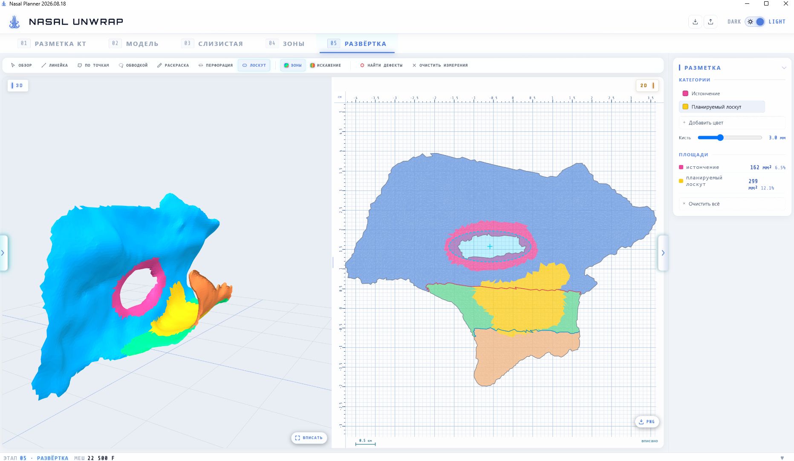

# Nasal Unwrap

Настольное приложение для планирования пластики перфорации носовой
перегородки. Строит по КТ трёхмерную модель полости носа, выделяет
слизистую и **разворачивает её в плоскую карту** — по такой карте
хирург измеряет дефект и подбирает лоскут, не пересчитывая размеры
с изогнутой поверхности в уме.



> **Это исследовательский инструмент.** Не медицинское изделие.

---

## Зачем это нужно

Слизистая носовой перегородки — изогнутая поверхность. Хирург видит её
на КТ послойно и оценивает размеры дефекта приблизительно, а лоскут
должен закрыть перфорацию с запасом, но при этом хватить донорской зоны.

Приложение разворачивает поверхность на плоскость с контролем искажений
и показывает площади зон в мм². Дальше можно измерять линейкой прямо
по карте: длины и площади считаются по трёхмерной поверхности, а не
по картинке, поэтому изгиб на результат не влияет.

---

## Как это работает

Пять этапов, каждый на своей вкладке:

| # | Этап | Что происходит |
|---|------|----------------|
| 01 | **Разметка КТ** | DICOM → сегментация полости носа нейросетью SwinUNETR, правка маски кистью на срезах |
| 02 | **Модель** | Маска → треугольная сетка, очистка и децимация |
| 03 | **Слизистая** | Отделение внутренней поверхности от наружной, при необходимости — разрез модели, чтобы добраться до закрытых участков |
| 04 | **Зоны** | Разметка на перегородку, дно и латеральную стенку; границы правятся ползунками или проводятся мышью |
| 05 | **Развёртка** | LSCM + ARAP, измерение линейкой, площадей, диаметров перфораций, подбор лоскута |

<!--  -->
<!-- Видео работы: <ссылка> -->

### Что под капотом

**Сегментация** — SwinUNETR (MONAI), обучена на кадрированных томах
средней зоны лица. Локализация ROI — эвристика по костным структурам,
без второй сети.

**Развёртка** — LSCM для начального приближения, дальше ARAP-итерации.
Топология приводится к диску: перфорации сохраняются как есть,
артефактные петли заливаются, «ручки» разрезаются.

**Измерения** считаются по 3D-поверхности (Дейкстра по мешу), а не по
плоской карте. Растяжение развёртки на числа не влияет — только на то,
как участки выглядят на глаз.

---

### 3. Веса модели

Чекпойнт раздаётся через [Releases] — в репозиторий
он не входит из-за размера.

### 4. Запуск

При первом старте на вкладке «Разметка КТ» откройте «Настройки модели»
и укажите три пути: интерпретатор,
`infer_swinunetr_cli.py` и файл чекпойнта. Они запомнятся.

---

## Сборка исполняемого файла

```bash
pyinstaller nasal_planner.spec --noconfirm --clean
```

Результат — `dist/NasalPlanner/`. 
Проверка перед сборкой — оба импорта должны упасть.

---

## Формат `.nplan`

Вся работа над случаем сохраняется в один файл — это обычный ZIP
с манифестом и артефактами. Внутри лежит готовая обучающая пара
(`roi_ct` + `roi_mask` в одной геометрии), поэтому формат годится
и для обмена случаями, и для дообучения модели.


---

## Лицензия

MIT — см. [LICENSE](LICENSE).

Обратите внимание на дополнительное уведомление в конце файла: проект
не является медицинским изделием.
